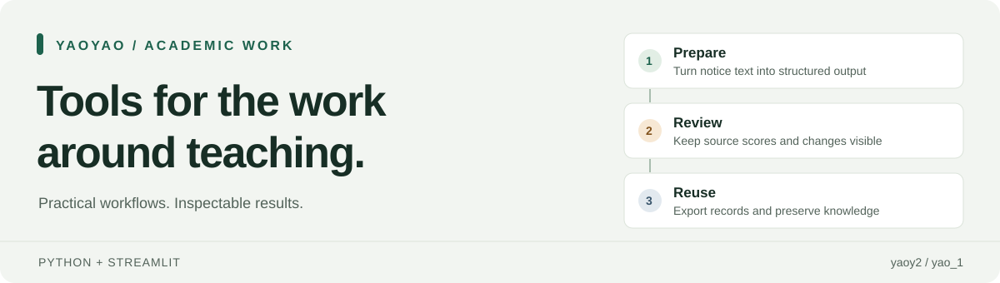

# YaoYao · 服务教学与行政工作的工具箱



[English](README_EN.md) · **简体中文**

[快速开始](docs/guides/getting-started.md) · [模块目录](docs/guides/module-catalog.md) · [参与贡献](CONTRIBUTING.md) · [迭代路线图](docs/guides/roadmap.md) · [更新日志](CHANGELOG_ZH-CN.md)

一个源于高校日常工作的 Python / Streamlit 工具箱：整理通知、复核教学成绩、管理待办、沉淀知识，让结果便于检查，让数据去向有据可查。

由 [yaoy2](https://github.com/yaoy2) 持续维护。仓库名仍为 `yao_1`，已有启动器和模块编号保持不变。

## 从三个具体场景认识项目

| 场景 | 可以检查的实际能力 | 从这里开始 |
| --- | --- | --- |
| **教学成绩复核** | 分开保留小组原始分、个人系数和各层调整，校验输入后导出 Excel 审核工作簿。 | [离线演示](docs/guides/getting-started.md#run-the-offline-grading-demo) · [计算与导出测试](tests/test_grade_workbench.py) |
| **通知整理与排版** | 从中文通知识别字段，检查排版，用一个浏览器文件导出 HTML。 | [第一份通知](docs/guides/first-notice.md) · [单文件编辑器](assets/email_notice_editor.html) |
| **持续跟进日常工作** | 记录截止时间与笔记，软归档已完成事项，按配置合并 GitHub 备份。 | [M14 / M10 目录](docs/guides/module-catalog.md) · [冲突与重试测试](tests/test_todo_chat.py) |

评分工作台服务于人工复核；结果仍需负责人确认。通知编辑器目前带有特定学院的默认值。涉及账号和远端备份的功能需另行配置。

## 先体验一个小场景

**直接使用单文件工具。** 下载 [`email_notice_editor.html`](assets/email_notice_editor.html)，在桌面浏览器打开即可，无需 Python 服务、API Key 或外部 JavaScript 库。先用[虚构通知示例](docs/guides/first-notice.md)试用，导出前核对机构字段。

**运行 Python 演示。** 项目提供 Windows 启动器。当前代码需要 Python 3.11 或以上版本；尚未建立覆盖多操作系统、多 Python 版本的完整验证矩阵。

```powershell
git clone https://github.com/yaoy2/yao_1.git
cd yao_1
python -m venv .venv
.\.venv\Scripts\python.exe -m pip install -r requirements-dev.txt
.\.venv\Scripts\python.exe scripts/demo_grade_workbench.py --output-dir outputs/demo-grade
```

演示只使用虚构数据，生成审核工作簿后重新读取并检查计算结果；无需凭据，不读取应用业务记录。再次运行时请选择新的输出目录。

使用完整工具箱时，先运行 `首次安装.bat`，再运行 `启动YaoYao工具箱.bat`。[快速开始](docs/guides/getting-started.md)说明依赖、演示与功能配置。[在线工具箱](https://whatsup.streamlit.app/)是维护者的部署实例，其中需要账号或本地配合的功能并非公共共享沙箱。

## 仓库包含什么

当前共有 **24 个入口：行政 7、教学 2、个人 7、archived 8**，其中 16 个位于当前分区。部分入口是只读指南或展示页，这个数字不代表独立应用数量。

| 分区 | 代表内容 | 使用边界 |
| --- | --- | --- |
| 行政 | 通知编辑器、课表、邮件工作台、随手传 | 部分功能依赖本地接收程序、凭据或已配对的收件端。 |
| 教学 | 评分工作台及使用说明 | 原始分数和调整层可以分别复核。 |
| 个人 | 笔记、配色、概念寓言、开发工具展示 | 各功能有自己的存储、备份规则。 |
| archived | M20 Ding2026、旧评分流程等退役工具 | 保留历史，不作为推荐使用入口。 |

[完整模块目录](docs/guides/module-catalog.md)列出每个编号、入口和状态；[`hello.py`](hello.py)是注册来源，文档检查会将目录与它比对。

```text
hello.py / pages/    Streamlit 页面入口
utils/              计算、解析、存储与导出逻辑
assets/             浏览器工具和有来源记录的静态资源
tests/              主应用回归检查
scripts/            演示及维护入口
docs/               安装、结构、路线图与历史记录
```

完整布局、独立项目与数据目录边界见[库结构](docs/repository-structure.md)。

<details>
<summary>独立项目与可复用技能</summary>

以下项目各有安装和数据边界；克隆主库不会自动启动它们。

| 项目 | 用途与状态 | 说明 |
| --- | --- | --- |
| Deepself | 个人表达研究和回复工具；原始朋友圈及私密报告仅留本机。 | [README](Deepself/README.md) |
| Zhongshengshi | 已暂停的 Next.js 多模型圆桌概念验证。 | [README](zhongshengshi/README.md) |
| Codex → Grok Builder | 按任务范围交接编码工作，保留具体执行边界。 | [说明](codex-grok-builder/README_EN.md) |
| GPT Planner · Luna Executor | 按任务需要选择规划与执行路线。 | [说明](gpt-planner-luna-executor/README_EN.md) |
| 115 AI Organizer | 云盘盘点与人工审核后的整理，执行需满足其专用授权要求。 | [README](115-ai-organizer/README.md) |

[个人技能集合](personal-skills/README_EN.md)收录 PPT 制作、评论真人图片筛选和存储分析。技能需独立安装，拉取仓库不会自动更新已安装副本。

</details>

## 工程与数据边界

- **结果可检查：** 成绩导出保留原始值和调整层。缺少调整原因会发出警告，并非所有警告都会阻止导出。
- **运行环境分开：** Streamlit Cloud、本地工作进程、独立项目不会共享本机文件系统。
- **外部服务按需配置：** AI 整理、邮件复核、GitHub 备份和文件传输各有配置及数据去向，详见[存储与服务说明](docs/guides/storage-and-services.md)。
- **保留工作记录：** 数据库和备份属于业务材料；离线演示使用独立的虚构数据，拒绝覆盖已有演示结果。

## 验证与参与

主应用的标准测试入口：

```powershell
.\.venv\Scripts\python.exe -m pytest -q tests
```

首次贡献可先运行：

```powershell
.\.venv\Scripts\python.exe -m pytest -q tests/test_project_docs_and_setup.py tests/test_grade_workbench.py tests/test_grade_workbench_demo.py tests/test_email_notice_standalone_html.py
```

独立子项目使用自己的测试入口。通知编辑器的 JavaScript 执行检查需要 Node.js，未安装时会明确跳过。维护验证采用单元测试、纯函数检查及现有 Streamlit AppTest；项目规则不允许仅为预览启动本地 Streamlit 服务。

[贡献指南](CONTRIBUTING.md)说明代码放在哪里、如何提供可复现问题、改动后需要验证什么。[路线图](docs/guides/roadmap.md)聚焦可运行示例、机构默认值配置、输入诊断和可复现安装。

## 项目阶段与许可

这是一个持续迭代的独立维护项目。[状态说明](docs/guides/project-status.md)区分已有能力、当前限制和待决定的许可事项，不宣称未经核实的用户规模或资助计划资格。

**源码公开，但尚未选定覆盖整个仓库的开源许可证。** 将整个仓库视为可自由复用的开源项目之前，需要明确授权。第三方资产保留自己的[来源说明](assets/awesome-design-md/SOURCE.md)与 [MIT 许可证](assets/awesome-design-md/LICENSE)。业务记录和私密材料不属于拟提供复用授权的代码范围。

[文档导航](docs/README.md) · [中文更新日志](CHANGELOG_ZH-CN.md) · [English change log](CHANGELOG_EN.md)
